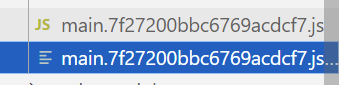
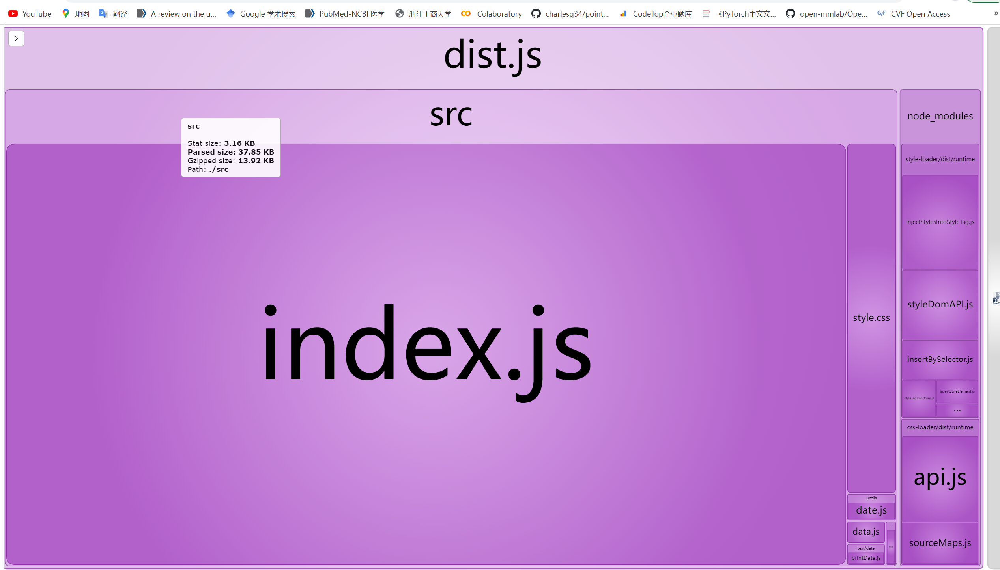

**webpack初始步骤：**

1. 创建文件mkdir text
2. 进入文件cd text
3. 若采用yarn打包工具`npm install -g yarn`
4. 初始化 yarn init -y
5. 添加webpack之类的包`yarn add webpack webpack-cli --dev` --dev表示开发者依赖
6. 打开text文件`code .`

**进入vs之后**（初次运用webpack打包）

1. 根目录下新建src代码文件夹，文件夹下创建index.js文件；根目录下新建index.html文件，文件内编辑，使用快捷命令`html:5`形成整个html代码

   ```html
   <!--添加-->
   <body>
       <h1>hello world</h1>
       <script src="./dist/main.js "></script>
       <!--使用都是打包后的文件，所以这边是dist/main.js-->
   </body>
   ```

2. 安装插件live server，可以在chrome浏览器看到页面

3. （简单演示webpack打包过程）在终端输入`npx webpack`

   可以看到打包生成了dist文件夹，下面存在一个main.js文件

4. 修改index.html->body->script中的src='./dist/main.js'（因为使用的都是打包后的文件）

5. src下新建data.js，输入

   ```js
   export function getBlogPosts(){//新建函数
       return ['post1','post2','post3'];
   }
   ```

   在src下的index.js中修改

   ```js
   import { getBlogPosts } from "./data";//这边是自动导入
   
   console.log(getBlogPosts());//输入上面创建的函数
   ```

6. 再次在终端输入`npx webpack`进行打包，可以在dist文件夹下的main.js看到

   ```js
   (()=>{"use strict";console.log(["post1","post2","post3"])})();
   ```

**webpack核心：配置文件**

1. 新建webpack.config.js文件，使用的是node.js模块化语法。

   ```js
   const path=require('path');//导入webpack.config.js的文件路径
   
   module.exports={
       mode:'development',//开发者模式，方便调试
       entry:'./src/index.js',//入口文件
       output:{//配置打包后的文件名
           filename:'dist.js',//文件名
           path:path.resolve(__dirname,'dist')//文件路径  path.resolve()接受多个参数，设置多级目录
       }
   };
   ```

   在终端输入`npx webpack`进行打包，可以看到生成了dist->dist.js文件，修改index.html中的src。删除掉main.js文件

2. 在index.js里面修改

   ```js
   import { getBlogPosts } from "./data";
   
   const blogs=getBlogPosts();
   const ul=document.createElement('ul');
   blogs.forEach(blog=>{
       const li=document.createElement('li');
       li.innerHTML=blog;
       ul.appendChild(li);
   });
   document.body.appendChild(ul);
   ```

   在终端输入`npx webpack`进行打包

3. 创建样式，在src下创建style.css文件

   ```css
   *{
       padding: 0;
       margin: 0;
       font-family: sans-serif;
   }
   body{
       display: grid;
       place-items: center;
       height: 100vh;
   }
   ul{
       list-style: none;
   }
   li {
       padding: 12px;
   }
   img{
       max-width: 500px;
   }
   ```

   在index.js中导入

   ```js
   import "./style.css";
   ```

   重点：

   需要下载合适的loader，在终端输入（这边安装2个loader)

   ```
   yarn add --dev style-loader css-loader
   ```

   并且在webpack.config.js中去匹配

   ```js
   module.exports={
       mode:'development',//开发者模式，方便调试
       entry:'./src/index.js',//入口文件
       output:{//配置打包后的文件名
           filename:'dist.js',//文件名
           path:path.resolve(__dirname,'dist')//文件路径  path.resolve()接受多个参数，设置多级目录
       },
       //添加部分
       module:{//什么样的扩展名配置什么样的loader
           rules:[{
               test:/\.css$/i,//匹配以css的后缀名 i忽略大小写
               use:['style-loader','css-loader'],
           }]
       }
   };
   ```

4. 插入图片，在配置中的module的rules添加

   ```js
   rules:[{
               test:/\.css$/i,//匹配以css的后缀名 i忽略大小写
               use:['style-loader','css-loader'],
           },{
               test:/\.(png|svg|jpg|jpeg|gif)$/i,//匹配以这些格式为后缀名的 忽略大小写
               type:'asset/resource',//内置属性
           }]
   ```

   在src下把图片放入到assets的img下，在index.js下输入

   ```js
   import HaiImage from "./assets/img/hai.jpg";
   
   const img=document.createElement('img');
   img.src=HaiImage;
   document.body.prepend(img);
   ```

   在终端输入`npx webpack`进行打包

5. 自动生成Html文件，终端中添加插件

   ```
   yarn add html-webpack-plugin --dev
   ```

   在webpack.config.js去导入

   ```js
   const HtmlWebpackPlugin=require('html-webpack-plugin');
   ```

   在module.exports中添加

   ```js
   plugins:[new HtmlWebpackPlugin()],
   ```

   可以看到dist文件夹下产生了一个index.html，自动生成的Html代码，可以看到是一样的效果

   ```js
   //传递参数，设置
   plugins:[
       new HtmlWebpackPlugin({
           title:'博客list',//标题
       })],
   ```

6. 使用babel来转义（例如，不支持箭头函数，把他转译成一般的函数），在终端输入

   ```
   yarn add --dev babel-loader @babel/core @babel/preset-env
   ```

   在webpack.config.js里面配置

   ```js
   devtool:'inline-source-map',//方便看打包后的代码
   module:{//什么样的扩展名配置什么样的loader
           rules:[{
               test:/\.css$/i,//匹配以css的后缀名 i忽略大小写
               use:['style-loader','css-loader'],
           },{
               test:/\.(png|svg|jpg|jpeg|gif)$/i,//匹配以这些格式为后缀名的 忽略大小写
               type:'asset/resource',//内置属性
           },{
               test:/\.js$/,//匹配js文件
               exclude:/node_modules/,//排除掉node_modules，表示不会转义这个文件夹下的代码
               use:{
                   loader:'babel-loader',
                   options:{//给loader传递一些配置
                       presets:['@babel/preset-env']
                   }
               }
           }
       ]
       }
   ```

   检查：

   ```js
   //index.js中的代码
   blogs.forEach(blog=>{
       const li=document.createElement('li');
       li.innerHTML=blog;
       ul.appendChild(li);
   });
   document.body.appendChild(ul);
   //打包后转换成了
   blogs.forEach(function (blog) {
     var li = document.createElement('li');
     li.innerHTML = blog;
     ul.appendChild(li);
   });
   //因为ES6不支持箭头函数
   ```

7. 压缩打包后的代码，终端输入

   ```
   yarn add --dev terser-webpack-plugin
   ```

   配置

   ```js
   const TerserPlugin=require('terser-webpack-plugin');
   optimization:{
       minimize:true,//是否要压缩
       minimizer:[new TerserPlugin()],//用什么工具来压缩
   },
   ```

   可以看到dist.js里面的代码都没有空格了（其中一大串字符表示图片被压缩成了base64）

8. 自动重新打包，在终端添加

   ```
   yarn add --dev webpack-dev-server
   ```

   配置

   ```js
   devServer:{
   	static:'./dist',//指定dist目录
   },
   ```

   在package.json中

   ```js
   "scripts": {
       "test": "echo \"Error: no test specified\" && exit 1",
       "start": "webpack serve --open"
   },
   ```

   终端输入

   ```
   yarn start
   ```

   自动开启

9. dist.js文件在浏览器中会缓存，避免缓存，为文件名加上随机的字符，配置

   ```js
   output:{//配置打包后的文件名
       filename:'[name].[contenthash].js',//[name]会替换成之前的main文件名，contenthash会hash计算
       path:path.resolve(__dirname,'dist')//文件路径  path.resolve()接受多个参数，设置多级目录
   },
   ```

   终端输入

   ```
   npx webpack
   ```

   会生成

   

   【因为浏览器缓存机制，如果不更新文件名，浏览器可能不会更新】

10. 为个别目录创建别名，例如"../../untils/date"（两级目录），配置

    ```js
    resolve:{
        alias:{
            untils:path.resolve(__dirname,'src/untils'),//别名：路径
        }
    },
    ```

    此时，就变成了"untils/date";

11. 可视化，终端输入

    ```
    yarn add --dev webpack-bundle-analyzer
    ```

    配置

    ```js
    const BundleAnalyzerPlugin=require('webpack-bundle-analyzer');
     plugins:[
         new HtmlWebpackPlugin({
             title:'博客list',//标题
         }),
         new BundleAnalyzerPlugin.BundleAnalyzerPlugin(),
     ],
    ```

    

webpack在后续的过程中会遇到更多的Loaders和Plugins